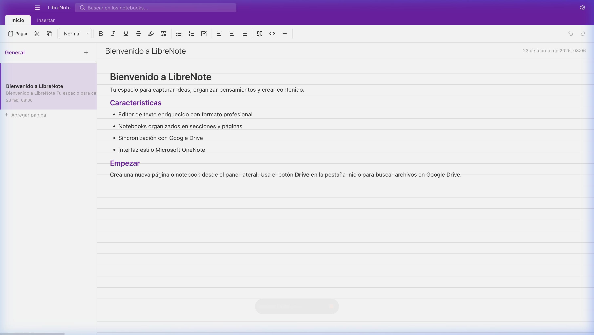
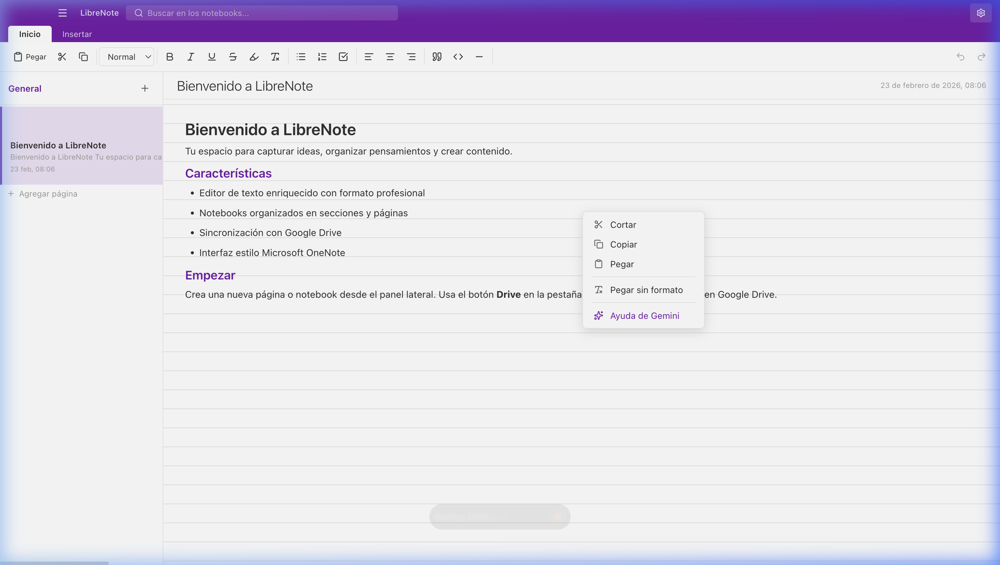
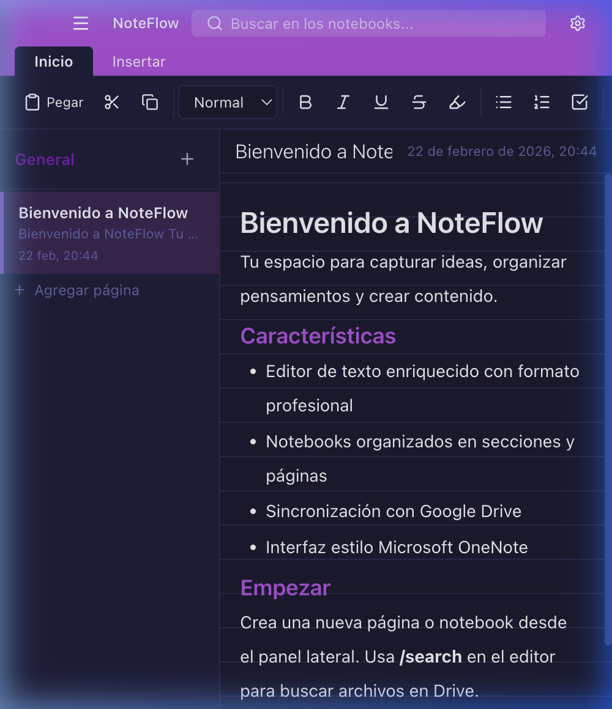

<p align="center">
  
</p>

<h1 align="center">LibreNote</h1>

<p align="center">
  <strong>Aplicación de notas de escritorio estilo OneNote — libre y de código abierto</strong><br>
  Editor enriquecido • Gemini AI • Google Drive • Modo Oscuro
</p>

<p align="center">
  
  
  
  
  
  
</p>

---

## ✨ Características

### 🤖 Inteligencia Artificial
- **Gemini AI integrado** — Clic derecho → "Ayuda de Gemini" para asistencia de IA directamente en el editor
- **Sugerencias rápidas** — Resumir, Mejorar, Expandir, Traducir, Corregir y Listar con un clic
- **Contexto automático** — Envía automáticamente el contenido de la página y el texto seleccionado como contexto
- **Auto-descubrimiento de modelos** — Detecta automáticamente el mejor modelo de Gemini disponible en tu cuenta
- **Insertar o reemplazar** — Inserta la respuesta al final, reemplaza la selección o cópiala

### 📝 Editor
- **Editor de texto enriquecido** — Títulos, negrita, cursiva, listas, tareas, bloques de código, citas, imágenes
- **Buscar y reemplazar** — Ctrl+F/Cmd+F con navegación, reemplazar uno por uno o reemplazar todos
- **Opciones de pegado** — Al pegar contenido formateado: mantener formato, combinar o solo texto
- **Quitar formato** — Botón en la barra de Inicio para limpiar formato del texto seleccionado
- **Menú contextual** — Cortar, Copiar, Pegar, Pegar sin formato, Ayuda de Gemini
- **Imágenes arrastrables** — Arrastra y redimensiona imágenes dentro de la página
- **Escribe en cualquier parte** — Haz clic en cualquier lugar de la página para empezar a escribir

### 📓 Organización
- **Estructura tipo OneNote** — Notebooks → Secciones → Páginas
- **Arrastrar páginas** — Reordena páginas dentro de una sección arrastrándolas
- **Duplicar página** — Clic derecho → Duplicar para crear una copia
- **Mover páginas** — Clic derecho → Mover a sección para enviar una página a otra sección/notebook
- **Confirmación de eliminación** — Modal de advertencia antes de eliminar notebooks

### ☁️ Google Drive
- **Sincronización bidireccional** — Sube y descarga notebooks automáticamente
- **Archivos adjuntos** — Inserta imágenes y archivos con upload a Drive
- **Búsqueda en Drive** — Botón en la pestaña Inicio para buscar e insertar archivos de Google Drive
- **Vista dual** — Descarga y abre local, o visualiza en el navegador

### 🎨 Interfaz
- **Modo oscuro / claro** — Detecta el sistema o configúralo manualmente
- **Diseño responsive** — Se adapta a pantallas pequeñas
- **Icono personalizado** — Diseño de cuaderno con lápiz en gradiente púrpura

<p align="center">
  
</p>

<p align="center">
  
</p>

<p align="center">
  
</p>

## 🚀 Instalación

### Descargar

Descarga la última versión compilada para macOS desde [Releases](https://github.com/dilangvidal/LibreNote/releases).

> **Nota para macOS:** Si aparece una advertencia de "app dañada", haz clic derecho sobre LibreNote.app → Abrir.

### Desde el código fuente

#### Requisitos

- [Node.js](https://nodejs.org/) >= 18
- npm >= 9

#### Clonar y ejecutar

```bash
git clone https://github.com/dilangvidal/LibreNote.git
cd LibreNote
npm install
npm run dev
```

Esto lanza simultáneamente Vite (frontend) y Electron (desktop).

#### Compilar para producción

```bash
npm run build
```

Genera un `.dmg` instalable para macOS en la carpeta `dist/`.

## 🤖 Configuración de Gemini AI

1. Ve a [Google AI Studio](https://aistudio.google.com/apikey) y genera una API key
2. Abre LibreNote → ⚙️ Configuración → Gemini AI
3. Pega tu API key y haz clic en "Guardar"
4. Haz clic derecho en el editor → "Ayuda de Gemini" para usar la IA

> LibreNote detecta automáticamente el mejor modelo disponible en tu cuenta (prioriza modelos Flash para balance entre velocidad y calidad).

## 🔑 Configuración de Google Drive

Para habilitar la sincronización con Google Drive:

1. Ve a [Google Cloud Console](https://console.cloud.google.com/)
2. Crea un proyecto o selecciona uno existente
3. Habilita la **Google Drive API**
4. Crea credenciales **OAuth 2.0** (tipo "Desktop App")
5. Descarga el archivo `client_secret.json` y colócalo en `electron/`
6. En la pantalla de consentimiento OAuth, agrega tu email como **usuario de prueba**

> **Nota:** El archivo `client_secret.json` está en `.gitignore` por seguridad.

## 📁 Estructura del Proyecto

```
LibreNote/
├── electron/                  # Proceso principal de Electron
│   ├── main.js                # Ventana, menú, IPC handlers, Gemini AI
│   ├── gdrive.js              # Autenticación y API de Google Drive
│   └── preload.js             # Bridge seguro al renderer
├── src/                       # Frontend React
│   ├── context/
│   │   └── ThemeContext.jsx    # Modo oscuro/claro
│   ├── hooks/
│   │   ├── useNotebooks.js    # CRUD notebooks + reorder/duplicate/move
│   │   ├── useGDriveSync.js   # Sincronización con Drive
│   │   └── useResponsiveLayout.js
│   ├── services/
│   │   └── api.js             # Abstracción Electron/Browser + Gemini
│   ├── utils/
│   │   └── helpers.js         # Utilidades reutilizables
│   ├── extensions/
│   │   └── DraggableImage.js  # Extensión TipTap para imágenes
│   ├── components/
│   │   ├── EditorArea.jsx     # Editor TipTap con popups y Gemini
│   │   ├── RibbonBar.jsx      # Barra de herramientas
│   │   ├── Sidebar.jsx        # Panel de notebooks
│   │   ├── PageList.jsx       # Lista con drag & drop
│   │   ├── GeminiPanel.jsx    # Panel de IA con sugerencias
│   │   ├── FindReplaceBar.jsx # Buscar y reemplazar
│   │   ├── ConfirmDeleteModal.jsx
│   │   ├── SettingsModal.jsx  # Config: Drive, Apariencia, Gemini
│   │   └── DriveSearchPopup.jsx
│   ├── App.jsx                # Orquestador principal
│   ├── main.jsx               # Entry point con ThemeProvider
│   └── index.css              # Design system completo
├── build/                     # Icono de la app (.icns, .png, .svg)
├── assets/                    # Screenshots para README
├── package.json
└── vite.config.js
```

## 🛠️ Stack Tecnológico

| Tecnología | Uso |
|------------|-----|
| **Electron 28** | App de escritorio para macOS |
| **React 18** | UI declarativa con hooks |
| **TipTap 2.6** | Editor WYSIWYG basado en ProseMirror |
| **@google/genai** | SDK oficial de Google Gemini AI |
| **Vite 5** | Build tool ultrarrápido |
| **Lucide React** | Iconos SVG modernos |
| **Google Drive API** | Sincronización bidireccional en la nube |

## 📄 Licencia

MIT — Puedes usar, modificar y distribuir libremente.

---

<p align="center">
  Hecho con 💜 usando Electron + React + TipTap + Gemini AI
</p>
